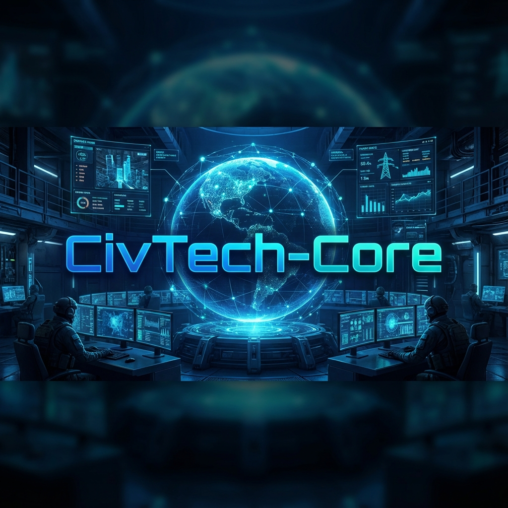

# �️ CivTech-Core



> **"İnşaat Mühendisliğini Yapay Zeka ve Otomasyon ile Yeniden Keşfetmek"**
> *Reinventing Civil Engineering through Artificial Intelligence and Automation*

[](https://opensource.org/licenses/MIT)
[](https://www.python.org/downloads/)
[](https://github.com/bahattinyunus/CivTech-Core)
[](https://github.com/psf/black)

**CivTech-Core**, geleneksel inşaat mühendisliği disiplinlerini modern bilgisayar bilimleri teknolojileriyle (**Yapay Zeka, Nesnelerin İnterneti, Büyük Veri Analitiği, Bulut Bilişim**) birleştiren, açık kaynaklı, yeni nesil bir mühendislik çekirdeğidir. Bu depo, betonarme yapıların statik hesaplamalarından şantiye yönetimindeki lojistik akışlara, malzeme biliminden kentsel planlamaya kadar inşaat sektörünün her adımını dijitalleştirmeyi amaçlayan, bütünleşik bir "İnşaat İşletim Sistemi" (Construction OS) vizyonu taşır. Bizler, inşaat sahasını sadece fiziksel bir üretim alanı olarak değil, sürekli veri üreten ve bu verilerle optimize edilen karmaşık bir siber-fiziksel sistem olarak tanımlıyoruz.

Bu proje, sadece bir kod kütüphanesi veya araç seti değildir; mühendislerin "akıllı şehirler", "otonom yapılar" ve "kendi kendini onaran malzemeler" çağına geçişi için gerekli olan entelektüel ve teknik altyapıyı sunan yaşayan bir ekosistemdir. Geleceğin şehirlerini inşa etmek için gereken dijital tuğlaları burada kodluyoruz. **CivTech-Core**, mühendisliği hesap makinesinden kurtarıp, algoritmaların ve yapay zekanın gücüyle yeniden donatmayı hedefler.

---

## 🎯 Misyon ve Vizyon: Mühendisliğin Yeni Çağı

### Statik Dünyadan Dinamik Evrene Geçiş: Determinizmin Sonu
Geleneksel inşaat mühendisliği, yüzyıllardır büyük ölçüde deterministik hesaplamalara, aşırı güvenli kabul edilen statik katsayılara ve manuel, hataya açık iterasyonlara dayanmaktadır. Newton mekaniğinin güvenli limanlarında kalmak artık yeterli değildir. İçinde yaşadığımız modern dünya karmaşık, dinamik, stokastik ve veri doludur. **CivTech-Core**, mühendisliği "bir defaya mahsus yapı inşa etmekten" öteye taşıyarak, yapıları "yaşayan, veri üreten, öğrenen, adapte olan ve kararlar alabilen organizmalar" olarak ele alır. Amacımız, betonun fiziksel dayanıklılığını, kodun sonsuz esnekliği ve zekası ile birleştirmektir.

### Veri Egemenliği (Data Sovereignty) ve Dijital İkizler (Digital Twins)
Vizyonumuzun kalbinde, fiziksel dünyadaki her bir kolonun, kirişin, sensörün ve iş makinesinin siber uzayda yaşayan, nefes alan birer dijital ikizini (Digital Twin) oluşturmak yatar. Bu ikizler, fiziksel varlığın sadece geometrik bir kopyası değil, davranışsal ve tarihsel bir yansımasıdır. Bu sayede, deprem anında saniyeler içinde hasar tespiti yapan algoritmalar, şantiyede malzeme israfını sıfıra indiren otonom botlar ve enerji verimliliğini maksimize eden adaptif cephe sistemleri birer bilim kurgu hayali olmaktan çıkıp endüstri standardı haline gelecektir. Biz, inşaat sektörünün **"Dijital Rönesansı"**nı başlatıyor ve veriyi yeni yüzyılın çimentosu olarak ilan ediyoruz.

---

## 🛠️ Temel Modüller ve Teknik Derinlik

Bu repo, her biri spesifik bir mühendislik problemine odaklanan, modüler ve genişletilebilir bir mimari üzerine kurulmuştur. Her modül, kendi alanındaki en iyi teknolojileri (State-of-the-Art) kullanır.

### 1. 🧠 [AI-Structural-Analysis](./AI-Structural-Analysis) (Yapay Zeka Destekli Yapısal Analiz)

Bu modül, klasik sonlu elemanlar yöntemini (FEM) modern yapay zeka teknikleriyle hibritleyerek, hesaplamalı mühendislikte paradigma değişimi yaratır. Physics-Informed Neural Networks (PINNs) kullanarak, fizik kurallarını ihlal etmeyen yapay zeka modelleri geliştiririz.

*   **Generative Design & Topology Optimization (Üretken Tasarım):** İnsan zihninin önyargılı sınırlarını aşan tasarımlar için Genetik Algoritmalar (Genetic Algorithms) ve Evrimsel Stratejiler kullanır. Belirlenen yük koşulları, rüzgar hızı, malzeme kısıtları ve maliyet hedefleri altında, minimum malzeme ile maksimum dayanımı ve estetiği sağlayan geometriyi sistem otomatik olarak üretir. Mühendisin rolü "çizen teknisyen" olmaktan çıkıp, "sınır koşullarını ve hedefleri belirleyen küratör" haline gelir.
*   **Sismik Tahmin ve Davranış Modellemesi (ML-Based Seismic Prediction):** Geçmiş yüzyılın küresel deprem verileri (Time-History Analysis) üzerinde eğitilmiş gelişmiş Derin Öğrenme (Deep Learning) modelleri (LSTM, Transformer, Graph Neural Networks), yapının lineer olmayan davranışlarını, plastikleşme noktalarını ve göçme modlarını milisaniyeler içinde tahmin eder. Bu, günler süren non-lineer zaman tanım alanlı analiz sürelerini saniyelere indirger ve acil durum tahliye senaryoları için hayati önem taşır.

### 2. ️ [BIM-Automation](./BIM-Automation) (Yapı Bilgi Modellemesi Otomasyonu)

BIM süreçlerini manuel veri girişinin hantal ve hataya açık yapısından kurtarıp, tam otomatik "Script-Based" ve "Algorithmic" bir iş akışına dönüştürür.

*   **Computational Geometry ve Parametrik Tasarım:** Revit ve Rhino gibi endüstri standardı yazılımlar için geliştirilen karmaşık Python betikleri (Dynamo & Grasshopper entegrasyonu), parametrik tasarımların doğrudan BIM ortamına aktarılmasını sağlar. Matematiksel formüllerle ifade edilebilen karmaşık cephe sistemleri, amorf kabuk yapılar veya parametrik stadyum çatıları, tek bir satır kod değişikliği ile yeniden modellenebilir.
*   **Auto-Schedule, Cost Estimation & 4D/5D Planning:** Yapay zeka motorumuz, 3D model üzerinden anlık olarak metraj çıkarır (Quantity Take-off), dinamik piyasa verileriyle maliyet analizi yapar ve şantiye iş programını (4D) optimize eder. Tedarik zinciri aksamalarını simüle ederek ve  öngörerek "Just-in-Time" malzeme sevkiyatını yönetir, böylece stok maliyetlerini ve saha kaosunu minimize eder.

### 3. 📡 [IoT-Structural-Health](./IoT-Structural-Health) (Yapısal Sağlık İzleme ve SHM)

Binaların sinir sistemini oluşturarak onları "akıllı" ve "iletişim kurabilen" sibernetik varlıklara dönüştürür. Edge Computing prensipleriyle veriyi kaynağında işler.

*   **Advanced Sensor Fusion (İleri Sensör Füzyonu):** Binanın kritik noktalarına yerleştirilen ivmeölçerler, gerinim ölçerler (strain gauges), fiber optik sensörler ve eğim ölçerlerden gelen yüksek frekanslı ham veriyi Kalman Filtreleri ve Bayesyen ağlar ile işleyerek gürültüden arındırır. Farklı sensör tiplerinden gelen veriyi birleştirerek (füzyon), tek bir sensörün veremeyeceği bütüncül bir sağlık resmi çizer.
*   **Real-Time Fatigue & Damage Detection (Gerçek Zamanlı Hasar Tespiti):** Yapısal elemanlardaki mikro çatlakları, korozyon ilerlemesini ve malzeme yorulmasını (fatigue) sürekli izler. Kritik eşik değerleri aşıldığında (örneğin bir deprem sonrası artçı şokta veya aşırı rüzgar yüklemesinde), bina sakinlerine veya yetkililere otomatik, konum tabanlı uyarı gönderen akıllı bir "Erken Uyarı Sistemi"ni barındırır.

### 4. 🎓 [Education-Curriculum](./Education-Curriculum) (Yeni Nesil Müfredat: Mühendis 4.0)

Sadece bugünü değil, geleceği de inşa etmek için mühendislik eğitiminde radikal bir reform paketi sunar. "Ezberleyen değil, türeten mühendis" yetiştirmeyi hedefler.

*   **First Principles Thinking & White-Box Modeling:** Mühendislik problemlerini kapalı kutu (black-box) yazılımlarla çözmeyi reddeder; bunun yerine fiziksel temel prensiplerden türeterek ve Python simülasyonları ile modelleyerek (white-box) öğretir. Öğrenci, "programın verdiği sonucun" kölesi değil, "algoritmanın efendisi" olur.
*   **Interactive Computational Notebooks:** Statik, Mukavemet, Akışkanlar Mekaniği ve Zemin Mekaniği gibi temel dersler için hazırlanmış, zenginleştirilmiş Jupyter Notebook'ları içerir. Öğrenciler diferansiyel denklemleri kağıt üzerinde değil, `SciPy` ve `NumPy` kütüphaneleri ile interaktif olarak çözer, sonuçları 3D olarak görselleştirir ve parametrelerle oynayarak fiziği hisseder. Teorik formüller, çalışan koda dönüşür.

---

## 🏛️ Entegre Sistem Mimarisi (Architectural Design)

CivTech-Core, yüksek ölçeklenebilirlik (Scalability), modülerlik ve güvenlik prensipleriyle tasarlanmış, çok katmanlı (Multi-Layered) bir yazılım mimarisine sahiptir:

1.  **Veri Akış Katmanı (Data Ingestion Layer):** Sahadaki IoT sensörlerinden (MQTT/CoAP), meteoroloji istasyonlarından (API), İHA'lardan (Fotogrametri) ve BIM modellerinden gelen heterojen ve büyük verinin (Big Data) toplandığı, temizlendiği ve normalize edildiği katman. Apache Kafka gibi akış işleme teknolojileri kullanılır.
2.  **Analitik Çekirdek (Core Processing Engine):** Python ekosisteminin hesaplama gücünü (Pandas, TensorFlow, PyTorch, Scikit-learn) arkasına alan, ham verinin stratejik bilgiye dönüştüğü merkezdir. Burada çalışan algoritmalar, CPU ve GPU üzerinde paralel işleme (Parallel Computing) yaparak devasa matrisleri çözer.
3.  **Servis Katmanı (Service Layer & API):** İşlenen verinin dış dünyaya açıldığı, RESTful ve GraphQL API'larının bulunduğu katman. Mikroservis mimarisi sayesinde, her bir analiz modülü (örn. Sismik Analiz Servisi) bağımsız olarak ölçeklenebilir.
4.  **Kullanıcı Arayüzü (Presentation Layer):** Mühendislerin sistemle etkileşime girdiği son nokta. CLI (Command Line Interface) araçları, Web tabanlı Dashboard'lar (React/Plotly) veya doğrudan BIM yazılımları (Revit/Rhino) içine gömülü eklentiler (Add-ins) olarak sunulur.

---

## 🏗️ Teknoloji Yığını ve Altyapı (Technology Stack)

CivTech-Core, endüstriyel sağlamlık ve akademik derinliği bir araya getiren "Best-in-Class" teknolojiler üzerine inşa edilmiştir.

### 💻 Core & Backend
*   **Dil:** Python 3.9+ (Type Hinting, AsyncIO)
*   **Bilimsel Hesaplama:** NumPy, SciPy, Pandas
*   **Paralel İşleme:** Dask, Ray (Büyük veri setleri için dağıtık hesaplama)

### 🧠 AI & Machine Learning Engine
*   **Deep Learning:** PyTorch, TensorFlow
*   **Explainable AI (XAI):** SHAP, Lime (Karar mekanizmalarının şeffaflığı için)
*   **Computer Vision:** OpenCV, YOLOv8 (Şantiye güvenliği ve hasar tespiti için)

### 🔌 Entegrasyon ve Uyumluluk (Interoperability)
CivTech-Core, kapalı bir kutu değil, mevcut ekosistemle konuşan bir köprüdür.

| Platform | Entegrasyon Teknolojisi | Kullanım Amacı |
| :--- | :--- | :--- |
| **Autodesk Revit** | PyRevit, Dynamo | BIM modellerinden otomatik veri çekme ve geometri oluşturma. |
| **Rhino / Grasshopper** | Rhino.Python, GhPython | Parametrik tasarım ve karmaşık yüzey optimizasyonu. |
| **SAP2000 / ETABS** | CSi API | Yapısal analiz sonuçlarının otomatik doğrulanması. |
| **IoT Cloud** | MQTT, REST API | Sensör verilerinin buluta aktarımı ve gerçek zamanlı izleme. |

---

## 🚀 Başlangıç Rehberi

Bu "Mühendislik Komuta Merkezi"ne katılmak ve kendi makinenizde çalıştırmak için aşağıdaki teknik adımları takip ediniz.

### Donanım ve Yazılım Gereksinimleri
*   **İşletim Sistemi:** Windows 10/11 (Endüstriyel BIM yazılımları ile tam uyumluluk için önerilir) veya Linux (Sunucu tarafı işlemler ve model eğitimi için).
*   **Python:** Sürüm 3.9 veya üzeri (Type hinting ve modern syntax desteği için).
*   **BIM Entegrasyonu:** Autodesk Revit 2023+ veya Rhino 7+ (Gerekli API lisanslarına sahip olmanız beklenir).
*   **Donanım:** Makine öğrenmesi modellerini eğitmek ve büyük veri setlerini işlemek için NVIDIA CUDA destekli bir ekran kartı (GPU) ve minimum 16GB RAM önerilir.

### Adım Adım Kurulum

1.  **Depoyu Klonlayın:**
    Terminalinizi açın ve en güncel çekirdek kodlarını yerel makinenize indirin.
    ```bash
    git clone https://github.com/bahattinyunus/CivTech-Core.git
    cd CivTech-Core
    ```

2.  **Sanal Ortam Oluşturun:**
    Proje bağımlılıklarının diğer projelerinizle çakışmasını önlemek için izole bir Python ortamı kurun.
    ```bash
    python -m venv venv
    .\venv\Scripts\activate  # Windows için
    # source venv/bin/activate  # Linux/Mac için
    ```

3.  **Bağımlılıkları Yükleyin:**
    Gerekli tüm bilimsel ve mühendislik kütüphanelerini (numpy, pandas, tensorflow, revitron, scipy vb.) tek komutla yükleyin.
    ```bash
    pip install -r requirements.txt
    ```

4.  **Sistemi Test Edin:**
    Kurulumun başarısını doğrulamak ve sistemin sağlıklı çalıştığından emin olmak için birim testleri çalıştırın.
    ```bash
    python -m unittest discover tests
    ```

---

---

## ⚖️ Karşılaştırmalı Mühendislik Paradigması

CivTech-Core yaklaşımının neden sadece bir "iyileştirme" değil, kökten bir "devrim" olduğunu gösteren paradigmatik farklar:

| Özellik | Geleneksel Mühendislik Yaklaşımı | CivTech-Core (Dijital) Yaklaşımı |
| :--- | :--- | :--- |
| **Karar Mekanizması** | Tecrübeye dayalı sezgisel tahminler, manuel iterasyonlar ve "göz kararı" yaklaşımlar (Rule of Thumb). | Büyük veri analitiği, istatistiksel modelleme ve yapay zeka destekli matematiksel optimizasyon (Data-Driven Decision Making). |
| **Güvenlik Anlayışı** | Bilinmezliği örtmek için keyfi yüksek güvenlik katsayıları ile aşırı boyutlandırma (Over-design) ve maliyet artışı. | Gerçek zamanlı sensör verisi ile yapının anlık sağlık durumunu izleme, proaktif bakım ve hassas mühendislik (Precision Engineering). |
| **Verimlilik & Sürdürülebilirlik** | Şantiye sahasında plansızlık ve koordinasyonsuzluk kaynaklı %20-30'lara varan malzeme ve zaman israfı. | Generative Design ve 4D AI planlama ile %100 malzeme optimizasyonu, minimum atık (Zero-Waste) ve karbon ayak izi takibi. |
| **Proje Süreci (Workflow)** | Birbirinden kopuk, haberleşmeyen "silo" disiplinler (Mimari, Statik, Mekanik) ve versiyon karmaşası. | Tek bir merkezi dijital model (BIM) üzerinde tam entegre, disiplinlerarası, eş zamanlı ve çakışmasız çalışma (Collaborative Engineering). |
| **Yapının Doğası** | İnşa edildiği gün ölmeye ve eskimeye başlayan, zamanla yorulan statik beton kütleleri. | Sensörlerle nefes alan, veri üreten, kendi durumunu raporlayan ve zamana adapte olan sibernetik ve yaşayan yapılar. |

---

## 🗺️ Gelecek Yol Haritası (Roadmap)

Sadece koda değil, bir vizyona yatırım yapıyoruz.

### Faz 1: Temel Atma (Mevcut Durum)
- [x] Çekirdek modüllerin (AI, BIM, IoT) mimari tasarımı.
- [x] Temel algoritmaların (Genetik Algoritma, YZ Tahmin) implementasyonu.
- [x] Açık kaynak topluluğu için dokümantasyonun hazırlanması.

### Faz 2: Otonomlaşma (2025 Q3 - 2026 Q1)
- [ ] **Canlı Şantiye Testleri:** IoT modülünün gerçek binalarda pilot uygulaması.
- [ ] **SaaS Dönüşümü:** Yerel çalışan kodların bulut tabanlı bir platforma taşınması.
- [ ] **AR/VR Entegrasyonu:** Şantiye yöneticileri için Artırılmış Gerçeklik (HoloLens) arayüzleri.

### Faz 3: Ekosistem ve Standartlaşma (2026+)
- [ ] **CivTech Marketplace:** Üçüncü parti geliştiricilerin kendi modüllerini ekleyebileceği bir eklenti mağazası.
- [ ] **Global Standartlar:** "Akıllı Yapı Sertifikasyonu" için uluslararası standartların belirlenmesi.

---

## 🤝 Katkıda Bulunma Protokolü

Bu proje, açık kaynak felsefesine sıkı sıkıya bağlıdır ve kolektif zeka ile güçlenir. Küresel mühendislik topluluğunun her türlü katkısına açıktır.

1.  **Fork & Branch:** Projeyi kendi hesabınıza fork'layın ve geliştireceğiniz özellik için `feature/YeniAlgoritma` isminde açıklayıcı bir dal (branch) açın.
2.  **Kod Standartları:** Yazdığınız Python kodlarının PEP 8 standartlarına uygun olduğundan, okunabilir olduğundan ve yeterli docstring (dokümantasyon) içerdiğinden emin olun.
3.  **Test:** Yazdığınız her yeni fonksiyon veya modül için kapsamlı birim testleri (Unit Test) eklemeyi unutmayın. "Test edilmemiş kod, bozuk koddur."
4.  **Pull Request:** Geliştirmenizi tamamladığınızda, yaptığınız değişiklikleri detaylıca anlatan bir Pull Request gönderin. Topluluk yöneticileri kodunuzu inceleyip ana çekirdeğe dahil edecektir.

---

## �‍💻 Mimar ve Geliştirici Hakkında

**Bahattin Yunus Çetin**
*IT Architect*

Bu proje, inşaat mühendisliği disiplinini modern yazılım mimarileriyle yeniden yorumlayan bütüncül bir vizyonun eseridir. Trabzon'un Of ilçesinde üniversite eğitimine devam eden Bahattin Yunus Çetin, akademik çalışmalarını profesyonel "IT Architect" yetkinlikleriyle harmanlayarak, inşaat teknolojileri (CivTech) alanında sektörel dönüşüme öncülük eden sistemler tasarlamaktadır.

Geleneksel mühendislik formasyonunu ileri düzey yazılım mühendisliği pratikleriyle birleştirerek, sadece çalışan kodlar değil, sürdürülebilir ve ölçeklenebilir dijital ekosistemler inşa etmeyi hedeflemektedir.

*   🌐 **GitHub:** [bahattinyunus](https://github.com/bahattinyunus)
*   👔 **LinkedIn:** [Bahattin Yunus Çetin](https://www.linkedin.com/in/bahattinyunus/)

---

## �📜 Yasal Uyarı ve Lisans

## 📜 Yasal Uyarı ve Lisans (Disclaimer & License)

Bu proje, bilginin özgürleşmesi adına **MIT Lisansı** altında açık kaynak olarak sunulmaktadır.

### Eğitim ve Araştırma Amaçlı Kullanım
Kodların eğitim, akademik araştırma, tez çalışmaları ve kişisel gelişim amaçlı kullanımı tamamen serbesttir ve şiddetle teşvik edilir. Bu repoyu bir laboratuvar olarak kullanın, kırın, dökün ve yeniden yapın.

### Kritik Güvenlik Uyarısı (Critical Safety Warning)
**DİKKAT:** Bu yazılım, deneysel algoritmalar ve araştırma amaçlı geliştirilmiş yapay zeka modelleri içermektedir. Gerçek dünya inşaat projelerinde, **özellikle can güvenliğini doğrudan ilgilendiren kritik statik hesaplamalarda ve yapısal tasarımlarda**, tek başına karar verici mekanizma olarak **ASLA KULLANILMAMALIDIR.**

Yazılımın ürettiği tüm sonuçlar, yetkin, lisanslı ve deneyimli bir inşaat mühendisi tarafından geleneksel yöntemlerle doğrulanmalı ve onaylanmalıdır. Yazar ve katkıda bulunanlar, yazılımın kullanımından doğabilecek maddi, manevi veya fiziksel zararlardan dolayı hiçbir yasal sorumluluk kabul etmez. Mühendislik etiği ve insan hayatı, her türlü algoritmadan önce gelir.

Detaylar ve lisans metninin tamamı için [LICENSE](./LICENSE) dosyasına bakınız.

---

<div align="center">

**CivTech-Core**
*Gelecek betonda değil, betonun içindeki veride saklıdır.*

[](https://github.com/bahattinyunus)
[](https://maps.google.com)

</div>
